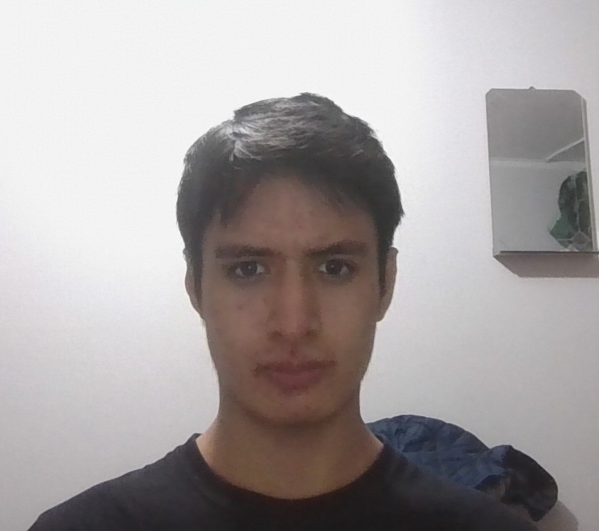
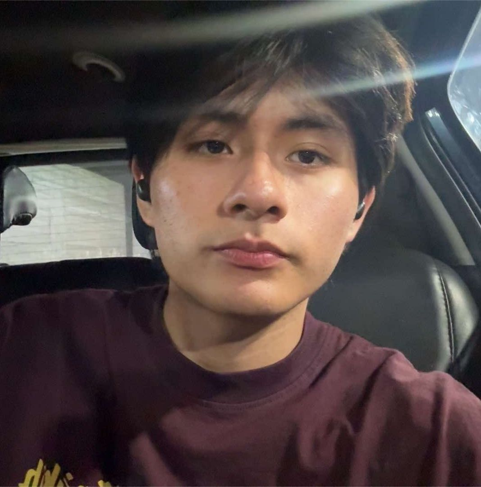
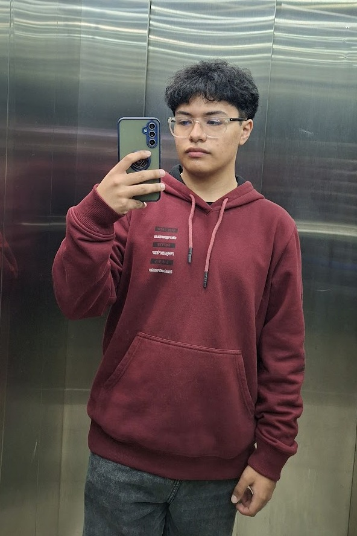
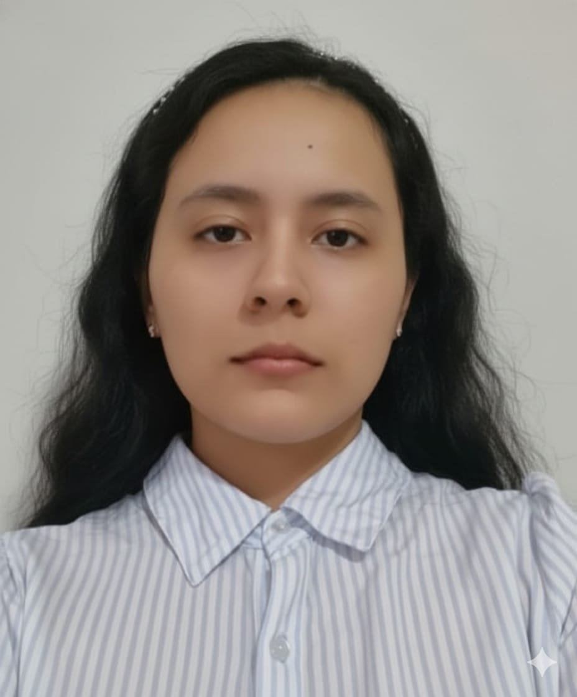

# Capítulo 1: Presentación

## 1.1. Startup Profile
### 1.1.1. Descripción de la startup

Nuestro startup, denominada “RebooTech”, surge con el objetivo de mejorar la gestión logística en la distribución
de frutas, frente a la falta de digitalización y coordinación entre productores, distribuidores y clientes comerciales, lo
que genera errores en pedidos y problemas en la calidad de los productos.

La misión de RebooTech es optimizar esta cadena de suministro mediante una plataforma web que centralice la
gestión de pedidos, permita su correcta asignación y facilite el control de calidad en cada etapa del proceso. De esta
forma, se busca mejorar la trazabilidad, reducir errores operativos y optimizar los tiempos de entrega.

La visión de RebooTech a futuro, proyecta incorporar tecnologías IoT, como sensores de temperatura y humedad en el
transporte, con el fin de garantizar condiciones adecuadas durante el traslado y consolidarse como una solución
innovadora en la logística del sector alimentario.

### 1.1.2. Perfiles de los integrantes del equipo:
| Foto                                                                | Apellidos y nombres                 | Código     | Descripción                                                                                                                                                                                                                                                                                                                                                                                                                                                                                                                                                                                                                                                                                                                                                                                                                                                                                                                                                                                                 |
|:--------------------------------------------------------------------|:------------------------------------|:-----------|:------------------------------------------------------------------------------------------------------------------------------------------------------------------------------------------------------------------------------------------------------------------------------------------------------------------------------------------------------------------------------------------------------------------------------------------------------------------------------------------------------------------------------------------------------------------------------------------------------------------------------------------------------------------------------------------------------------------------------------------------------------------------------------------------------------------------------------------------------------------------------------------------------------------------------------------------------------------------------------------------------------|
|      | Bojórquez Bustinza, Renzo Alejandro | u202411402 | Estudio la carrera de Ingeniería de Software, y ando cursando el sexto ciclo de la misma. Tengo experiencia liderando equipos de trabajo, coordinando actividades y proponiendo ideas innovadoras. Asimismo, he trabajado en anteriores propuestas de una magnitud similar, por lo que tengo conocimiento de estrategias que debemos aplicar durante el desarrollo, así como errores que debemos evitar. Destaco como mis fortalezas que soy responsable, perseverante y comprometido con los acuerdos que se establezcan entre los integrantes. Como líder del equipo RebooTech, me comprometo a mantener la organización durante el desarrollo del trabajo, promoviendo un ambiente respetuoso y colaborativo en el que todos se sientan cómodos trabajando.                                                                                                                                                                                                                                              |
|   | Chávez Bardales, Esteban Eduardo    | u20241b761 | Soy una persona responsable, creativa, y con diferentes conocimientos para el curso. Además, tengo diferentes habilidades para trabajar en equipo. Me destaco por mi creatividad e innovación. Asimismo, tengo habilidades de razonamiento para resolver problemas de forma rápida.                                                                                                                                                                                                                 |
|  | Cochachi Chagua, Sebastian Josue    | u202416320 | Soy estudiante de Ingeniería de Software enfocado en el desarrollo frontend. Cuento con conocimientos en la creación de aplicaciones web, además de manejar herramientas orientadas al diseño de interfaces o la gestión estructurada de proyectos. Gracias a mi certificación como Scrum Fundamentals Certified (SFC), busco aportar al equipo una mentalidad ágil para organizar nuestras tareas de forma eficiente. Mis principales fortalezas radican en la resolución de problemas técnicos, la atención al detalle al momento de maquetar soluciones visuales, así como un firme compromiso con los objetivos del grupo. Me considero una persona proactiva, siempre dispuesta a colaborar en las distintas fases del trabajo para asegurar la calidad final de nuestros entregables.                                                                                                                                                                                                                 |
|     | Marin Cueva, Cesar Fernando         | u202411937 | Soy estudiante de Ingeniería de Software con interés en el diseño de interfaces, la organización visual de contenido y la documentación estructurada de productos digitales. Dentro del equipo, aporto criterio para transformar información compleja en entregables claros, legibles y consistentes, lo que resulta especialmente útil en la redacción del informe y en la construcción de piezas de soporte orientadas a comunicar valor de negocio. Además, muestro disposición para colaborar transversalmente con otras áreas del proyecto, facilitando la integración entre comunicación, diseño y formalidad académica. Mis principales fortalezas residen en la sensibilidad por el diseño visual y la presentación ordenada de información, el apoyo en la redacción y depuración de contenido documental, la capacidad para colaborar en la estructuración de secciones y consistencia editorial, así como una constante disposición al trabajo en equipo y a la revisión cruzada de entregables. |
|    | Otiniano Rosales, Camila Alizée     | u202419547 | Estudiante de Ingeniería de Software con formación en desarrollo frontend y diseño de interfaces. Cuento con experiencia en el modelado de bases de datos y en la creación de aplicaciones web. Aporto al equipo liderazgo, organización y creatividad, además de mucho compromiso para sacar adelante los entregables y coordinar el trabajo en grupo.                                                                                                                                                                                                                                                                                                                                                                                                                                                                                                                                                                                                                                                     |
