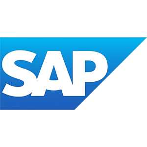
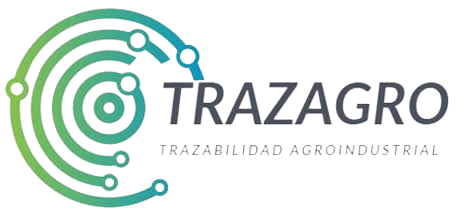

# Capítulo II: Requirements Elicitation & Analysis

## 2.1. Competidores

En el mercado peruano existen diversas soluciones tecnológicas orientadas a la gestión logística y distribución agrícola, las cuales representan competidores directos e indirectos para el proyecto **FruitLogix**. A continuación, se identifican y describen tres de los principales competidores:

* **AgroData Perú:** Plataforma digital peruana orientada a la trazabilidad y comercialización de productos agrícolas. Conecta a productores con compradores ofreciendo información sobre precios, volúmenes y calidad de productos del campo, posicionándose como un referente en la digitalización del agro en el país.
* **SAP Agri:** Solución ERP de alcance internacional con módulos especializados en la gestión de la cadena de suministro agrícola. Es utilizada por grandes corporaciones del sector para automatizar procesos logísticos, control de calidad y trazabilidad desde el origen hasta el punto de venta.
* **TrazAgro:** Plataforma latinoamericana de trazabilidad agrícola enfocada en el seguimiento de productos desde su origen hasta el consumidor final. Se orienta al cumplimiento de estándares de inocuidad alimentaria y la certificación de procesos para exportación y retail.

### 2.1.1. Análisis competitivo

<table>
  <thead>
    <tr>
      <th colspan="6" style="text-align: left;"><b>Competitive Analysis Landscape</b></th>
    </tr>
    <tr>
      <td rowspan="2"><b>¿Por qué llevar a cabo este análisis?</b></td>
      <td colspan="5">
        Se lleva a cabo este análisis para identificar las características y estrategias de los competidores en el mercado de gestión logística agrícola, con el fin de diferenciar a <b>FruitLogix</b> mediante una propuesta innovadora de valor que optimice la trazabilidad, el control de calidad y la coordinación entre productores, distribuidores y supermercados.
      </td>
    </tr>
    <tr>
    </tr>
<!-- FILA DE CABECERA CON LOGOS -->
    <tr>
      <th colspan="2"><b>Criterio de Análisis</b></th>
      <th>
         
        <b>FruitLogix</b>
      </th>
      <th>
         
        <b>AgroData Perú</b>
      </th>
      <th>
         
        <b>SAP Agri</b>
      </th>
      <th>
         
        <b>TrazAgro</b>
      </th>
    </tr>
  </thead>
  <tbody>
    <tr>
      <td rowspan="2"><b>Perfil</b></td>
      <td><b>Overview</b></td>
      <td>Startup universitaria que desarrolla una plataforma web centralizada para gestionar pedidos, validar calidad y garantizar trazabilidad en la distribución de frutas entre productores, distribuidores y supermercados.</td>
      <td>Plataforma digital peruana de información agrícola que conecta productores con compradores mediante datos de precios, volúmenes y calidad de productos.</td>
      <td>Sistema de software internacional (ERP) con módulos para la gestión de la cadena de suministro agrícola, utilizada por grandes corporaciones del sector.</td>
      <td>Plataforma latinoamericana de trazabilidad agrícola enfocada en el cumplimiento de estándares de inocuidad y certificación de procesos para retail y exportación.</td>
    </tr>
    <tr>
      <td><b>Ventaja competitiva</b></td>
      <td>Integración completa del flujo logístico (pedidos, calidad y trazabilidad) en una sola plataforma accesible y adaptada al mercado peruano de frutas.</td>
      <td>Amplia base de datos de precios y productores a nivel nacional, con presencia consolidada en el agro peruano.</td>
      <td>Robustez tecnológica, respaldo de marca global y capacidad de integración con sistemas empresariales complejos.</td>
      <td>Especialización en trazabilidad y cumplimiento normativo para mercados exigentes de exportación y retail.</td>
    </tr>
    <tr>
      <td rowspan="2"><b>Perfil de Marketing</b></td>
      <td><b>Mercado objetivo</b></td>
      <td>Productores, distribuidores y supermercados medianos de frutas en el Perú que buscan digitalizar su cadena de suministro.</td>
      <td>Productores agrícolas y compradores mayoristas que necesitan información de mercado actualizada.</td>
      <td>Grandes empresas agroindustriales con presupuesto para soluciones ERP de alto costo.</td>
      <td>Empresas agrícolas orientadas a la exportación y cadenas de retail que exigen certificación de trazabilidad.</td>
    </tr>
    <tr>
      <td><b>Estrategias de marketing</b></td>
      <td>Enfoque en digitalización accesible, alianzas estratégicas con distribuidoras y supermercados locales, y demostración de valor mediante la reducción de rechazos y errores logísticos.</td>
      <td>Posicionamiento como fuente confiable de información de mercado agrícola, con presencia en medios especializados del sector.</td>
      <td>Marketing corporativo B2B dirigido a grandes empresas, con énfasis en integración tecnológica y soporte global.</td>
      <td>Posicionamiento en certificación y cumplimiento normativo, con enfoque en mercados de exportación.</td>
    </tr>
    <tr>
      <td rowspan="3"><b>Perfil de Producto</b></td>
      <td><b>Productos & Servicios</b></td>
      <td>Plataforma web con módulos de gestión de pedidos, asignación de órdenes, validación de calidad e integración IoT para monitoreo de condiciones de transporte.</td>
      <td>Portal de información de precios y volúmenes agrícolas, directorio de productores y herramientas básicas de comercialización.</td>
      <td>Módulos ERP para planificación de recursos, gestión de cadena de suministro, control de calidad y trazabilidad.</td>
      <td>Sistema de trazabilidad con registro de lotes, certificación de procesos y reportes de inocuidad alimentaria.</td>
    </tr>
    <tr>
      <td><b>Precios & Costos</b></td>
      <td>Modelo de suscripción accesible basado en volumen de pedidos, con costos moderados adaptados a distribuidores medianos.</td>
      <td>Acceso gratuito a información básica con planes de suscripción para funciones avanzadas.</td>
      <td>Licenciamiento corporativo de alto costo, con costos de implementación y mantenimiento elevados.</td>
      <td>Costos variables según el volumen de productos trazados y el nivel de certificación requerido.</td>
    </tr>
    <tr>
      <td><b>Canales de distribución</b></td>
      <td>Plataforma web accesible desde computadora y dispositivos móviles, con dashboard en tiempo real para todos los actores de la cadena.</td>
      <td>Portal web y aplicación móvil con acceso a datos de mercado y directorio de productores.</td>
      <td>Implementación <i>on-premise</i> o en la nube, con soporte técnico especializado y consultoría.</td>
      <td>Plataforma web con módulos de registro, seguimiento y generación de reportes de trazabilidad.</td>
    </tr>
    <tr>
      <td rowspan="4"><b>Perfil de SWOT Análisis</b></td>
      <td><b>Fortalezas</b></td>
      <td>Solución integral adaptada al mercado peruano, con módulos de pedidos, calidad y trazabilidad en una sola plataforma.</td>
      <td>Conocimiento profundo del mercado agrícola local y base de datos consolidada de productores.</td>
      <td>Robustez tecnológica, escalabilidad y respaldo de una marca global reconocida.</td>
      <td>Especialización en trazabilidad y cumplimiento de estándares internacionales de inocuidad.</td>
    </tr>
    <tr>
      <td><b>Debilidades</b></td>
      <td>Startup en etapa inicial, con recursos limitados y dependencia de validación técnica del producto.</td>
      <td>No gestiona el flujo logístico completo; se limita a información de mercado y precios.</td>
      <td>Costos elevados que limitan el acceso a pequeñas y medianas empresas del sector.</td>
      <td>Enfoque principalmente en exportación, con menor adaptación al retail local peruano.</td>
    </tr>
    <tr>
      <td><b>Oportunidades</b></td>
      <td>Crecimiento del comercio digital en el agro peruano, integración futura de IoT y expansión hacia otros productos agrícolas.</td>
      <td>Ampliar funcionalidades hacia la gestión de pedidos y trazabilidad para captar más segmentos.</td>
      <td>Expansión hacia medianas empresas agroindustriales con versiones más accesibles.</td>
      <td>Crecimiento del retail moderno en el Perú y mayor exigencia de trazabilidad por parte de supermercados.</td>
    </tr>
    <tr>
      <td><b>Amenazas</b></td>
      <td>Competidores consolidados con mayor capital y posible resistencia al cambio tecnológico en actores tradicionales del sector.</td>
      <td>Entrada de plataformas más completas que ofrezcan información y gestión logística integrada.</td>
      <td>Competidores más ágiles y económicos orientados específicamente al agro latinoamericano.</td>
      <td>Plataformas locales que ofrezcan trazabilidad a menor costo y con mayor adaptación al mercado peruano.</td>
    </tr>
  </tbody>
</table>

### 2.1.2. Estrategias y tácticas frente a competidores

#### **Estrategias:**

* **Diferenciación mediante integración completa del flujo logístico:**
  * **Objetivo:** Posicionar a **FruitLogix** como la única solución que gestiona de forma integral el ciclo completo de distribución de frutas: desde el registro del pedido hasta la entrega final con validación de calidad.
  * **Acciones:** Desarrollar módulos interconectados de gestión de pedidos, asignación de órdenes, control de calidad e integración IoT para el monitoreo de condiciones de transporte.
  * **Resultados esperados:** Destacar frente a competidores que solo cubren partes del proceso, ofreciendo una experiencia unificada y eficiente para todos los actores de la cadena.

#### **Tácticas:**

* **Alianzas estratégicas con supermercados y programas agrícolas:**
  * **Objetivo:** Generar credibilidad y visibilidad en el mercado desde etapas tempranas.
  * **Acciones:** Establecer alianzas con programas como *Perú Pasión* y acercarse a cadenas de retail como *Plaza Vea* para implementar proyectos piloto que demuestren el valor de la plataforma.
  * **Resultados esperados:** Mayor adopción del sistema y generación de casos de éxito que sirvan como referencia para nuevos clientes.

* **Modelo de precios accesible y escalable:**
  * **Objetivo:** Reducir la barrera de entrada para distribuidores medianos que no pueden asumir el costo de soluciones ERP tradicionales.
  * **Acciones:** Ofrecer un modelo de suscripción basado en el volumen de pedidos procesados, con una versión básica gratuita durante el primer mes de uso.
  * **Resultados esperados:** Mayor tasa de adopción inicial y fidelización progresiva a medida que los usuarios comprueban el valor de la plataforma.